# Active PEPs

Quick reference of all PEPs currently in the workflow. Update this table when a PEP changes status. Remove rows when a PEP is moved to [IMPLEMENTED/LATEST.md](IMPLEMENTED/LATEST.md).

| PEP  | Title                          | Status   | Effort | Risk   | Depends On |
|------|--------------------------------|----------|--------|--------|------------|
| 0003 | Extend Data Models              | Implementing | M      | Medium | —          |
| 0004 | Event Outbox Infrastructure     | Proposed | M      | Medium | PEP 0003   |

## Dependency Graph

```mermaid
graph TD
    PEP0003["🟡 0003: Extend Data Models"]
    PEP0004["🟡 0004: Event Outbox Infrastructure"]
    PEP0004 --> PEP0003
```

**Legend:** 🔴 High risk | 🟡 Medium risk | 🟢 Low risk
