# Active PEPs

Quick reference of all PEPs currently in the workflow. Update this table when a PEP changes status. Remove rows when a PEP is moved to [IMPLEMENTED/LATEST.md](IMPLEMENTED/LATEST.md).

| PEP  | Title                                      | Status   | Effort | Risk   | Depends On              |
|------|--------------------------------------------|----------|--------|--------|-------------------------|
| 0006 | S3 Upload Storage                          | Implementing | S      | Medium | —                       |
| 0007 | File Portal Pipeline                       | Implementing | L      | High   | PEP 0006                |
| 0008 | Canonical Domain Model for OSS Ingest Portal | Proposed | L      | High   | —                       |
| 0009 | Storage Backend Abstraction                | Proposed | M      | Medium | PEP 0008                |
| 0010 | Authentication and API Access              | Proposed | M      | Medium | PEP 0008                |
| 0011 | Upload Session Creation                    | Proposed | M      | Medium | PEP 0008, 0009, 0010    |
| 0012 | Chunk Upload Endpoint                      | Proposed | L      | High   | PEP 0008–0011           |
| 0013 | Session Resume and Status Endpoint         | Proposed | S      | Low    | PEP 0008, 0010, 0011    |
| 0014 | Finalize Upload                            | Proposed | L      | High   | PEP 0008–0012           |
| 0015 | Batch Upload Support                       | Proposed | M      | Medium | PEP 0008, 0010          |
| 0016 | Canonical file.uploaded Event Schema       | Proposed | S      | Medium | PEP 0008, 0014          |
| 0017 | Durable Outbox Dispatcher                  | Proposed | L      | High   | PEP 0008, 0014, 0016    |
| 0018 | Minimal OSS User Interface                 | Proposed | L      | Medium | PEP 0008, 0010, 0014, 0015, 0017 |
| 0019 | Operational Guardrails and Cleanup         | Proposed | M      | Medium | PEP 0008, 0009, 0017    |

## Dependency Graph

```mermaid
graph TD
    PEP0006["🟡 0006: S3 Upload Storage"]
    PEP0007["🔴 0007: File Portal Pipeline"]
    PEP0008["🔴 0008: Canonical Domain Model"]
    PEP0009["🟡 0009: Storage Backend"]
    PEP0010["🟡 0010: Auth & API Access"]
    PEP0011["🟡 0011: Session Creation"]
    PEP0012["🔴 0012: Chunk Upload"]
    PEP0013["🟢 0013: Session Resume"]
    PEP0014["🔴 0014: Finalize Upload"]
    PEP0015["🟡 0015: Batch Support"]
    PEP0016["🟡 0016: Event Schema"]
    PEP0017["🔴 0017: Outbox Dispatcher"]
    PEP0018["🟡 0018: OSS UI"]
    PEP0019["🟡 0019: Guardrails & Cleanup"]

    PEP0006 --> PEP0007

    PEP0008 --> PEP0009
    PEP0008 --> PEP0010
    PEP0009 --> PEP0011
    PEP0010 --> PEP0011
    PEP0011 --> PEP0012
    PEP0008 --> PEP0013
    PEP0010 --> PEP0013
    PEP0011 --> PEP0013
    PEP0012 --> PEP0014
    PEP0008 --> PEP0015
    PEP0010 --> PEP0015
    PEP0014 --> PEP0016
    PEP0016 --> PEP0017
    PEP0014 --> PEP0017
    PEP0015 --> PEP0018
    PEP0017 --> PEP0018
    PEP0014 --> PEP0018
    PEP0010 --> PEP0018
    PEP0009 --> PEP0019
    PEP0017 --> PEP0019
```

**Legend:** :red_circle: High risk | :yellow_circle: Medium risk | :green_circle: Low risk
