# Active PEPs

Quick reference of all PEPs currently in the workflow. Update this table when a PEP changes status. Remove rows when a PEP is moved to [IMPLEMENTED/LATEST.md](IMPLEMENTED/LATEST.md).

| PEP  | Title                          | Status   | Effort | Risk   | Depends On |
|------|--------------------------------|----------|--------|--------|------------|
| 0006 | S3 Upload Storage              | Proposed | S      | Medium | —          |
| 0007 | File Portal Pipeline           | Proposed | L      | High   | PEP 0006   |

## Dependency Graph

```mermaid
graph TD
    PEP0006["🟡 0006: S3 Upload Storage"]
    PEP0007["🔴 0007: File Portal Pipeline"]
    PEP0006 --> PEP0007
```

**Legend:** :red_circle: High risk | :yellow_circle: Medium risk | :green_circle: Low risk
